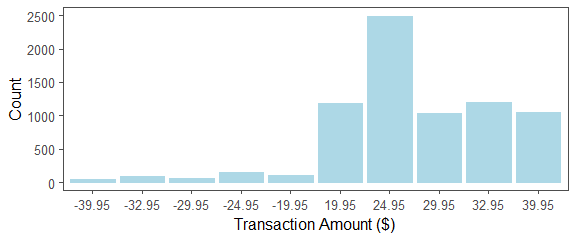
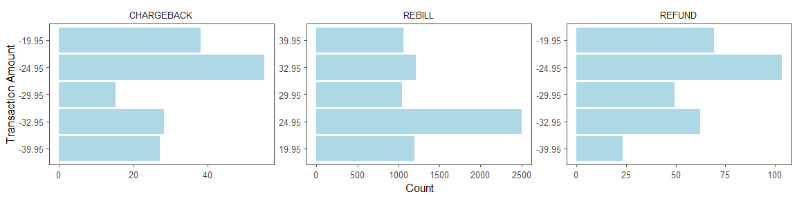
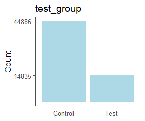

### Contents

1. **Load (data and libraries)**
2. **EDA and (non)-Cleanup**
3. **The Questions**

### Load (data and libraries)


```r
library(tidyverse)  #For ggplot2 and dplyr
library(ggthemes)   #Used in conjunction with ggplot2, specifically for theme_few()

test <- read.csv("testSamples.csv")
trans <- read.csv("transData.csv")
```

### EDA and (non)-Cleanup 
(As will be seen in this section, no variables have missing or inappropriate values, so minimial effort was required - hence the 'non'.)

***How a typical row looks for each of test and trans***


```
##   sample_id test_group
## 1         1          0
```

```
##   transaction_id sample_id transaction_type transaction_amount
## 1       52346326        11           REBILL              24.95
```

***No missing values***


```r
sum(is.na(test)) + sum(is.na(trans))
```

```
## [1] 0
```

***test$sample_id - no duplicate values (as desired)***


```r
identical(test$sample_id, 1:nrow(test))
```

```
## [1] TRUE
```

***transaction_id - no duplicate values (as desired)***


```r
identical(trans$transaction_id, trans$transaction_id[1]:(trans$transaction_id[1]+nrow(trans)-1))
```

```
## [1] TRUE
```

***transaction_amount - no inappropriate values, positives and negatives are paired by magnitude, mostly positive transaction amounts***


```r
table(trans$transaction_amount)
```

```
## 
## -39.95 -32.95 -29.95 -24.95 -19.95  19.95  24.95  29.95  32.95  39.95 
##     50     90     64    158    107   1189   2492   1031   1199   1050
```



***transaction_type - no inappropriate values***

  
 
  

```r
table(trans$transaction_type)
```

```
## 
## CHARGEBACK     REBILL     REFUND 
##        163       6961        306
```

***CHARGEBACK and REFUND transactions are all negative; REBILL transactions are all positive (as desired)*** <br />
***Vast majority of transactions are REBILLs***


```r
table(trans$transaction_type, trans$transaction_amount>=0)
```

```
##             
##              FALSE TRUE
##   CHARGEBACK   163    0
##   REBILL         0 6961
##   REFUND       306    0
```




***No inappropriate values for test_group but it is skewed towards control group***


```r
table(test$test_group)
```

```
## 
##     0     1 
## 44886 14835
```



### The Questions


**Question 1:**
We saw above that our *test* dataset consists of 44886 people from the control group and 14835 from the test group. This corresponds to a Bernouilli distribution with estimated parameter p = 14835/(14835+44886) = 0.248 of a randomly-sampled member being assigned to the test group. <br /> <br />

*To answer questions 2-4 we need to SQL-style left join test and trans by sample_id, then partition join into the control and test groups.* 


```r
join <- merge(test, trans, by="sample_id", all.x=TRUE)
call <- filter(join, test_group==1)  #The test group
web <- filter(join, test_group==0)   #The control group
```
<br /> 

**Question 2:**
We will group both *web* and *call* by *sample_id* to count the number of *REBILL* transactions that took place for each of their customers. This information will be used to compute a one-sided hypothesis test for the difference in the proportion of *call* customers who had at least one *REBILL* and the proportion of *web* customers who had at least one *REBILL*, with the alternative hypothesis that *call* customers have the higher proportion. We also need to verify the conditions for hypothesis testing when comparing 2 proportions, hence why *s1, n1, s2, n2* and *p* are computed.


```r
call2 <- call %>% 
  group_by(sample_id) %>%
  summarise(num_REBILL=sum(transaction_type=="REBILL", na.rm=TRUE)) 
  #na.rm=TRUE is included so that customers with no transactions are assigned num_REBILL=0

s1 <- sum(call2$num_REBILL>0)   #This counts the number of call2 sample_id's with at least one REBILL
n1 <- nrow(call2)    #This counts the number of call2 sample_id's 

web2 <- web %>% 
  group_by(sample_id) %>%
  summarise(num_REBILL=sum(transaction_type=="REBILL", na.rm=TRUE))

s2 <- sum(web2$num_REBILL>0)   #This counts the number of web2 sample_id's with at least one REBILL
n2 <- nrow(web2)   #This counts the number of web2 sample_id's  
```

***Check the sample-size conditions for the hypothesis test***


```r
p <- (s1+s2)/(n1+n2)  #The pooled proportion of binomial successes (TRUE)

#The expected number of binomial successes (TRUE) and failures (FALSE) for call2 and web2
#We need all of these values to be >=10 for a hypothesis test to be appropriate.
floor(c(n1*p, n1*(1-p), n2*p, n2*(1-p)))
```

```
## [1]   620 14214  1876 43009
```
***The sample-size conditions are satisfied; now compute the one-sided hypothesis test***


```r
#"greater" is for a one-sided test in which we are testing if the first proportion is larger
#Here the first proportion is that for call2: s1/n1
prop.test(x=c(s1,s2), n=c(n1,n2), alternative="greater") 
```

```
## 
## 	2-sample test for equality of proportions with continuity
## 	correction
## 
## data:  c(s1, s2) out of c(n1, n2)
## X-squared = 1958.1, df = 1, p-value < 2.2e-16
## alternative hypothesis: greater
## 95 percent confidence interval:
##  0.07959321 1.00000000
## sample estimates:
##     prop 1     prop 2 
## 0.10488709 0.02096422
```

***Conclusion:***
We see that 10.5% of the test group made at least one additional *REBILL* compared to only 2.1% for the control group. More importantly, the p-value is <2.2e-16, much smaller than the standard significance level of 0.05. Therefore, the results are statistically significant, and it is safe to assume that the *call* customers are indeed more likely to generate at least one additional *REBILL* than the *web* customers. We can furthermore say with 95% confidence that the true absolute difference in these proportions is between 7.96% and 100%. <br /> <br />

**Question 3:**
In this question I am including the negative transaction amounts of *CHARGEBACK*s and *REFUND*s in the *net_revenue* computations (not just *REBILL*s). We will group both *web* and *call* by *sample_id* to compute the net revenue generated by each customer. This information will be used to compute a one-sided hypothesis test for the difference in the mean revenues of *call* customers and *web* customers, with the alternative hypothesis that *call* customers will have a larger mean revenue. Also, for hypothesis testing for paired means we require that both samples are of size>30, which is the case here.


```r
call3 <- call %>%
  group_by(sample_id) %>%
  summarise(net_revenue=sum(transaction_amount, na.rm=TRUE)) 
  #na.rm=TRUE is included so that customers with no transactions are assigned a net_revenue of 0.

web3 <- web %>%
  group_by(sample_id) %>%
  summarise(net_revenue=sum(transaction_amount, na.rm=TRUE))
```

***Now compute the one-sided hypothesis test*** 

```r
t.test(call3$net_revenue, web3$net_revenue, alternative="greater")
```

```
## 
## 	Welch Two Sample t-test
## 
## data:  call3$net_revenue and web3$net_revenue
## t = 19.096, df = 21378, p-value < 2.2e-16
## alternative hypothesis: true difference in means is greater than 0
## 95 percent confidence interval:
##  4.049772      Inf
## sample estimates:
## mean of x mean of y 
##  6.432996  2.001490
```
***Conclusion:***
We see that the mean revenue for the test group (6.4) is more than three times as large as that for the control group (2.0). More importantly, the p-value (<2.2e-16) is microscopic, and so this offers very strong evidence in favor of the alternative hypothesis that the test group customers indeed generate more revenue on average than the control group customers. This makes intuitive sense - for many people (particularly introverts) it might be more of a hassle to phone in to cancel a subscription and have to deal with someone than to just do it themselves online, and so I would suspect that these people might be less likely to cancel even if they want to. Moreover, we can say with 95% confidence that the true difference in the mean revenue generated by the test group and that of the control group is at least $4.05. <br /> <br />

**Question 4:**
We will group both *web* and *call* by *sample_id* to compute the chargeback rate for each of their customers. We will also need to filter out *sample_id*'s that have no transactions, as their chargeback rates would require division by 0. This information will be used to compute a one-sided hypothesis test for the difference in the mean chargeback rates of *web* customers and *call* customers, with the alternative hypothesis that *web* customers have higher chargeback rates. Also, for hypothesis testing for paired means we require that both samples are of size>30, which is the case here.


```r
call4 <- call %>%
  filter(!is.na(transaction_id)) %>%
  group_by(sample_id) %>%
  summarise(chargeback_rate = sum(transaction_type=="CHARGEBACK")/n()) 
  #n() is the number of transactions per sample_id

web4 <- web %>%
  filter(!is.na(transaction_id)) %>%
  group_by(sample_id) %>%
  summarise(chargeback_rate = sum(transaction_type=="CHARGEBACK")/n())
```

***Now compute the one-sided hypothesis test*** 

```r
t.test(web4$chargeback_rate, call4$chargeback_rate, alternative="greater")
```

```
## 
## 	Welch Two Sample t-test
## 
## data:  web4$chargeback_rate and call4$chargeback_rate
## t = 4.4993, df = 1542.1, p-value = 3.664e-06
## alternative hypothesis: true difference in means is greater than 0
## 95 percent confidence interval:
##  0.02037056        Inf
## sample estimates:
##  mean of x  mean of y 
## 0.04796108 0.01584098
```
***Conclusion:***
We see that the mean chargeback rate for the control group (0.048) is three times as large as that of the test group (0.016). Moreover the p-value (3.66e-06) is small and less than the standard significance level of 0.05. This means that there is strong reason to believe that the control group customers have a higher chargeback rate than the test group customers. Furthermore, we can say with 95% confidence that the true absolute difference in these two rates is at least 2.04%.


